# Importing A Library Tutorial

To make projects shareable we use project specfic libraries and not global libaries
## Step 1:
Create your KiCad Project with a Component Libraries Folder. In this folder
include the library folders from the git repo or any you create yourself/find online.
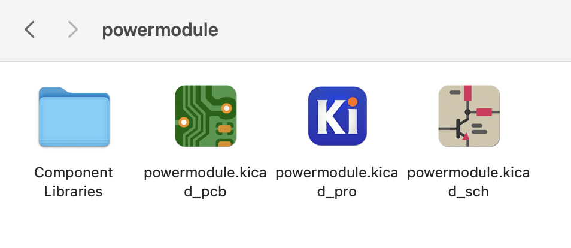

## Step 2: 
Click "Manage Symbol Libraries" while you have your project open
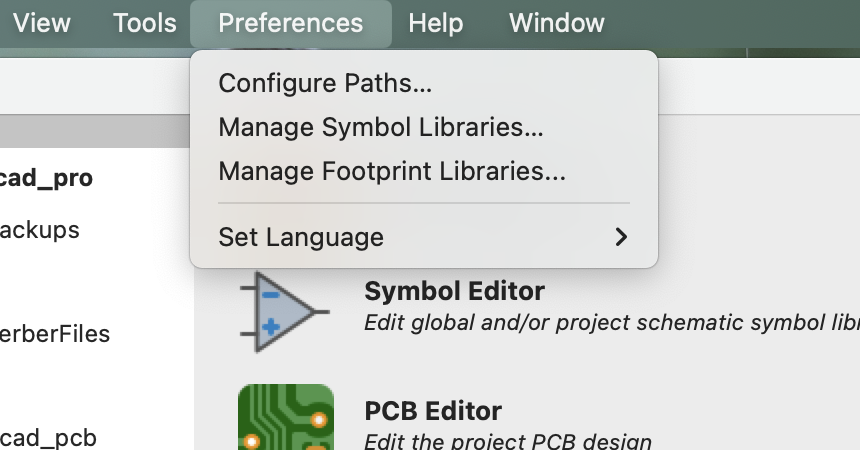

## Step 3:
Select Project Specific Library, press the plus and select the .kicad_sym file in your chosen library. Until you see the line as seen in this image. Choose a sensible nickname for your symbol and remember it you need it for the next step.
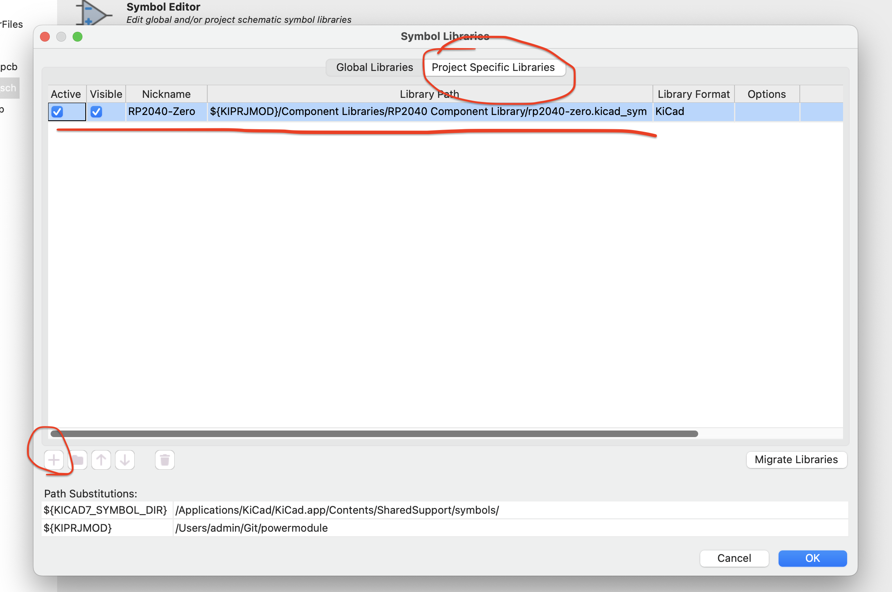

## Step 4:
Click "Manage Footprint Libraries" while you have your project open.

## Step 5:
Select Project Specific Footprint, press the plus and select the library folder that contains you .kicad_sym and .kicad_mod. Then you will see the line as seen in this image. Make the footprint nickname the same as the symbol nickname.
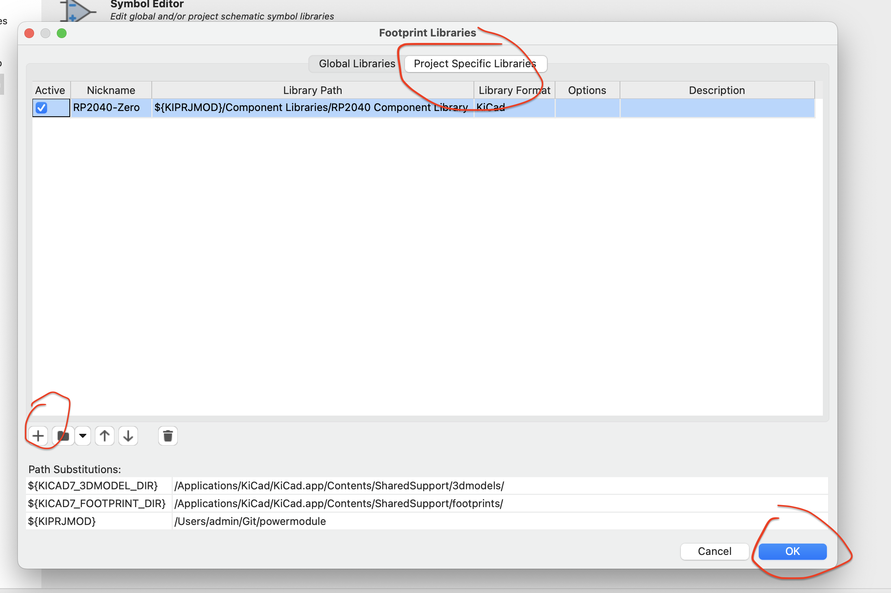

## Step 6:
Now go to your project schematic, and include a symbol by clicking the symbol on the right hand side, or by pressing 'a' . Search for your symbol nickname, in this case  RP2040-Zero, select it and press okay.
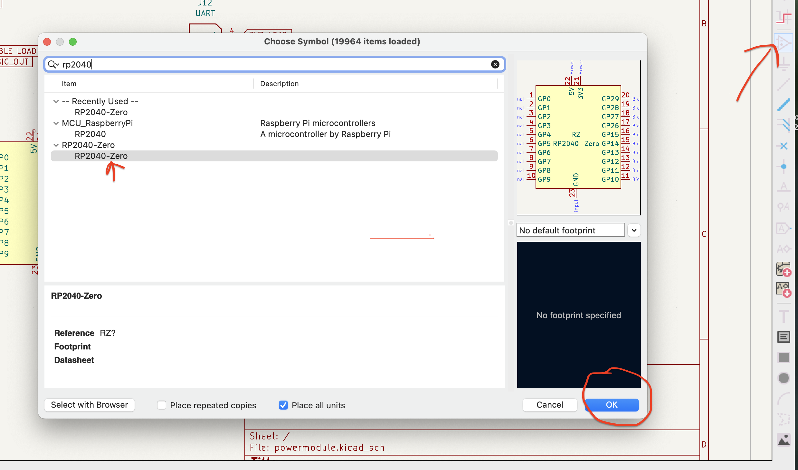

## Step 7:
Left click on the newly placed symbol and press 'e' or right click and select properties to open
this page, then click the circled book symbol.
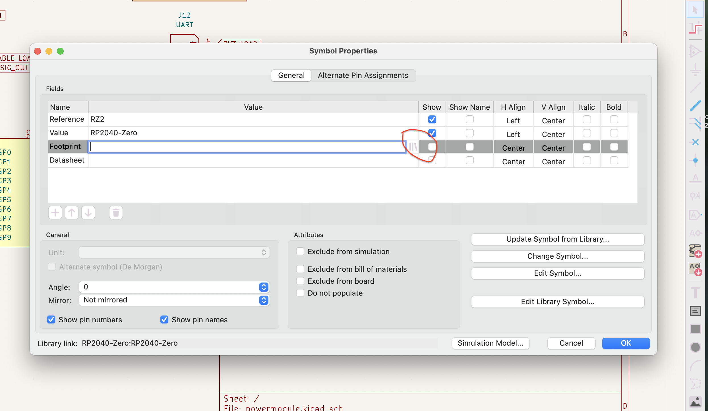

## Step 8:
Find the library on the left column and then select the footprint in the right column and press enter.
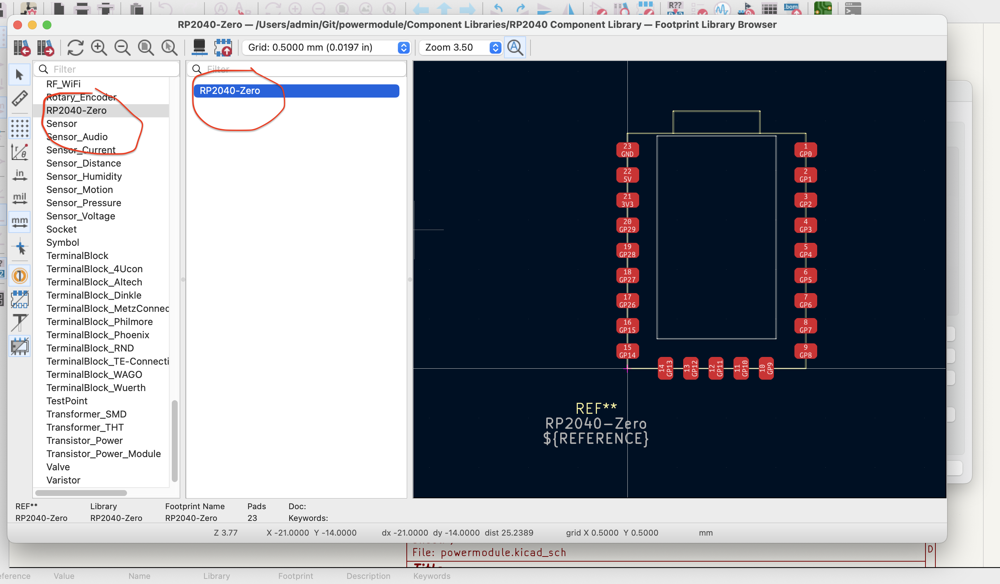

## Step 9:
you will now see there is a selected footprint, so when you switch to PCB editor and load the changed symbols by pressing this button 
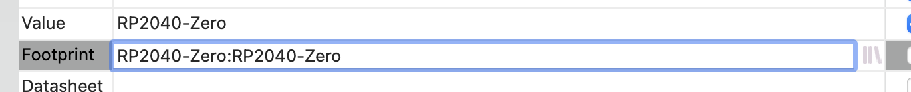

## Step 10:
Open the PCB Document, and press this button to load the new footprints and nets.
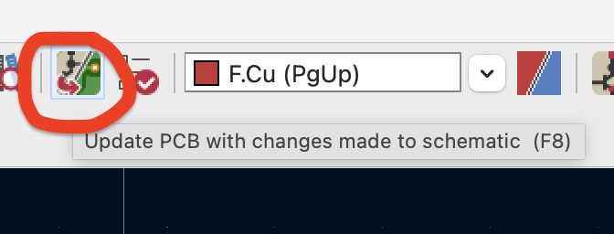

## Step 10:
OPTIONAL STEPS, helpful for generating 3d models of finished designs for case 
manufacturing or similar, so please do these steps if 3D Model is available.
Left click on the footprint and press 'e' or right click and select properties to open
this page, then click the circled + symbol. 
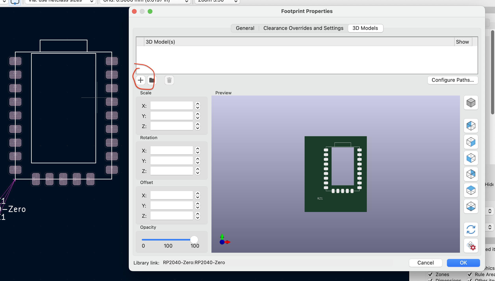

## Step 11:
Select the 3D model in the component library.
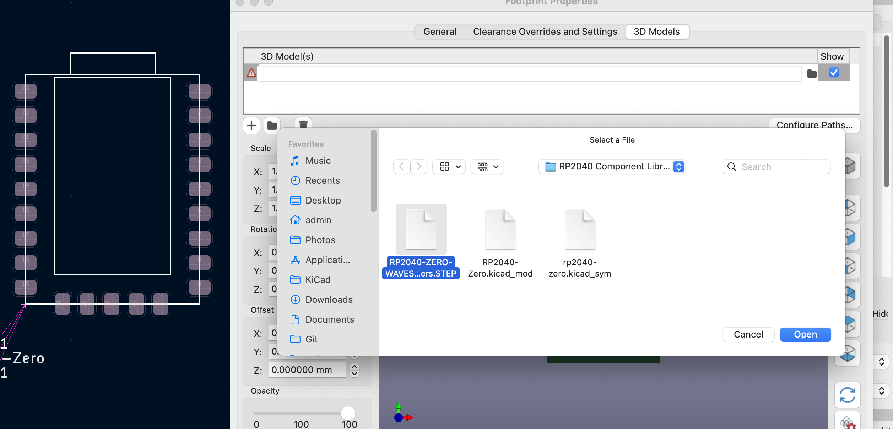

## Step 12:
Now the 3d Model will be placed, and you need to update the rotation and offset
until it lines up nicely
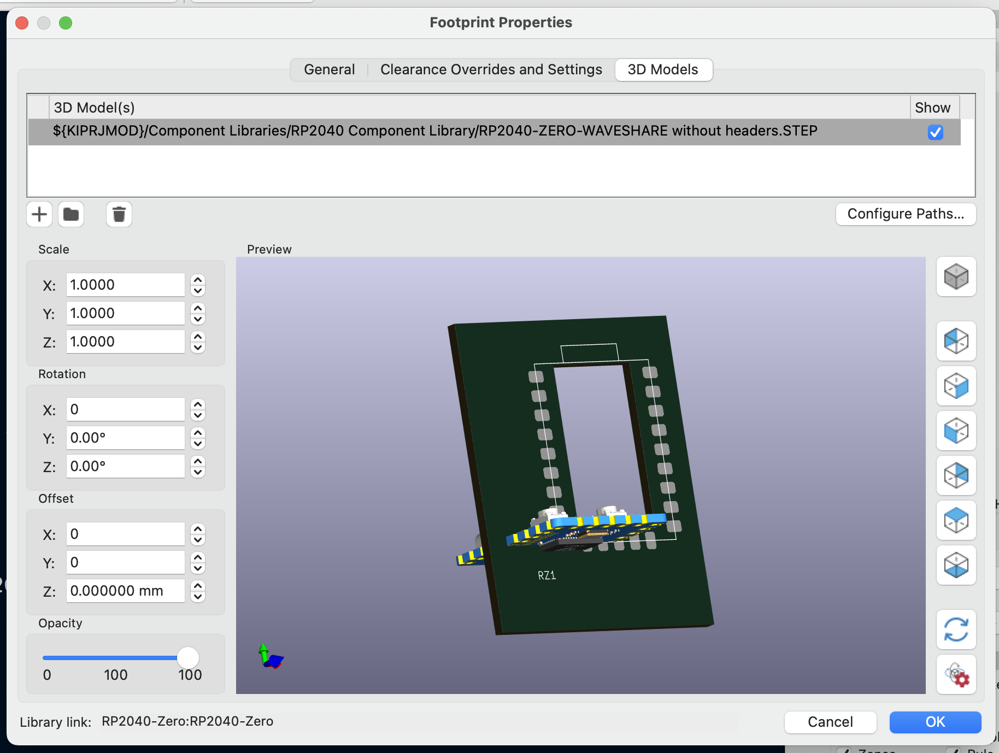

## Step 13:
Now you can press okay, and you have setup the library and can use the symbol, footprint, and 3D Viewer for your PCB.
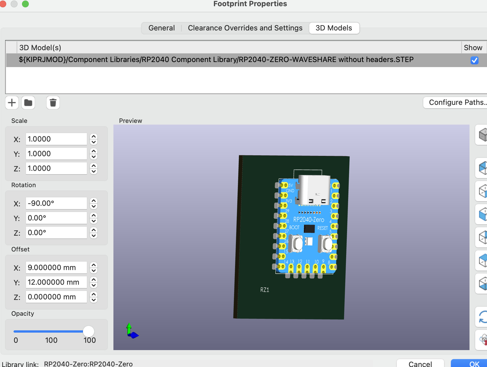

